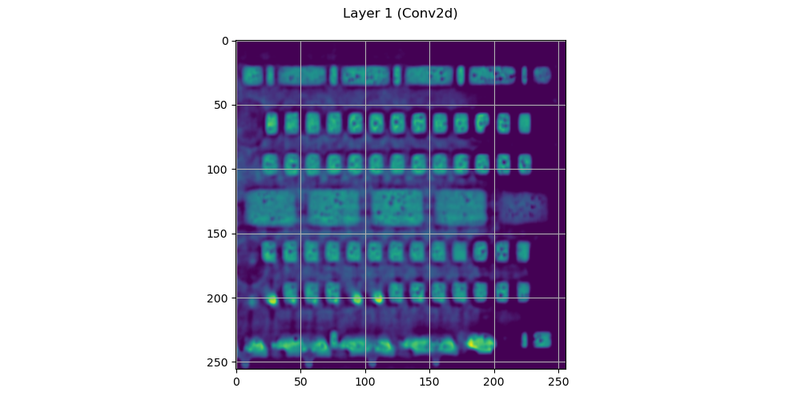

# Intrusion Detection System (IDS) using Deep learning

## Overview
This project is designed to classify 2D X-ray images to identify defects effectively. It utilizes a deep learning approach, specifically leveraging an auto-encoder architecture, to differentiate between images with and without defects. This capability is critical for ensuring quality control and assurance across manufacturing processes or other industries reliant on high-quality imaging analysis. To enhance the interpretability of the model's decisions, the project incorporates visualization techniques such as Grad-CAM. This method provides visual explanations for the model's predictions by highlighting the regions in the images that are most influential in determining whether a defect is present. Such visualizations not only aid in validating the model's effectiveness but also facilitate a deeper understanding of the key features that characterize defective and non-defective items.

## Installation

Ensure you have Python installed on your system to run the notebook. Python can be downloaded from [python.org](https://www.python.org/). After Python installation, install the necessary libraries using the following commands:

```bash
pip install numpy jupyter matplotlib torch torchvision scikit-learn torchcam
```

##  Usage
To get started with the IDS project, follow these steps:

1. Clone the Repository: Download the project files to your local machine.
2. Open the Notebook: Load the IDS.ipynb notebook in a Jupyter environment.
3. Run the Notebook: Execute the cells sequentially to operate the model. The notebook sections include:
    - Importing Libraries: Sets up the Python libraries needed.
    - Defining Hyperparameters: Specifies parameters that influence model behavior.
    - Data Preparation: Involves loading the images, possibly enhancing them, and splitting into training, validation, and test datasets.
    - Model Training: Details the steps to train the defect detection model.
    - Visualization with Grad-CAM: Uses Grad-CAM to generate attention maps, showing what features the model focuses on to make predictions.

## Model Explanation
The project uses Convolutional Neural Networks (CNNs) for image classification. The Grad-CAM visualizations are integrated to explain the model decisions by highlighting the influential regions in the images, thus providing insights into the model's focus and potential areas for improvement.

<p align="center">
  
</p>
